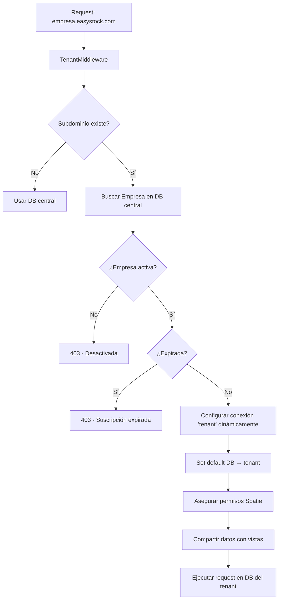
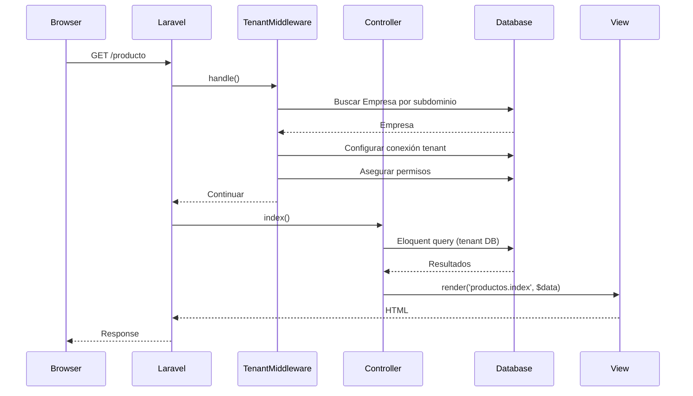

# Arquitectura del Sistema

## Stack Tecnológico

```
Frontend: AdminLTE 3 + Bootstrap 4 + DataTables + Select2 + Chart.js + SweetAlert2
Backend:  Laravel 10 + PHP 8.1
Base:     MySQL 8 (multi-tenant: database-per-tenant)
Auth:     Laravel UI (session) + Sanctum (API tokens)
Permisos: Spatie Laravel Permission v6
PDF:      TCPDF
QR:       Endroid QR Code + milon/barcode
```

---

## Multi-tenancy

EasyStock usa una arquitectura **base de datos por tenant**. Cada empresa (cliente) tiene su propia base de datos MySQL aislada.



### Implementación

**`app/Http/Middleware/TenantMiddleware.php`**:
1. Extrae el subdominio del host (`empresa.easystock.com` → `empresa`).
2. Busca el registro `Empresa` en la base central por `dominio`.
3. Valida que esté activa y no vencida.
4. Configura `database.connections.tenant` con las credenciales de la empresa.
5. Cambia `database.default` a `tenant`.
6. Auto-crea los permisos Spatie si no existen en la base del tenant.

### Rutas afectadas

- **Rutas sin subdominio** (localhost, www) → usan la DB central.
- **Rutas con subdominio** → middleware activa el tenant.

---

## Flujo de Petición



---

## Estructura MVC

```
app/Http/Controllers/
├── Auth/              # Login, Register, Passwords, Verification
├── Api/               # VentaControllerApi
├── AdminController
├── AutocompleteController
├── CajaReporteController
├── CategoriaController
├── ChequeController
├── CitaController
├── ClienteController
├── CompraController
├── ConfiguracionController
├── EmpresaController
├── EventoController
├── GastoController
├── HomeController
├── ImpuestoController
├── ProductoController
├── ProductoreporteController
├── ProfileController
├── ProveedorController
├── ReporteVentaController
├── ReporteVentaNuevoController
├── RolController
├── TablaPorcentajeController
└── VentaController
```

### Patrón de controladores

Cada módulo CRUD sigue el mismo patrón:

```php
class ProductoController extends Controller
{
    public function index()          // GET  /producto
    public function create()         // GET  /producto/create
    public function store(Request)   // POST /producto
    public function show($id)        // GET  /producto/{id}
    public function edit(Producto)   // GET  /producto/{id}/edit
    public function update(Request, Producto) // PUT /producto/{id}
    public function destroy(Producto)        // DELETE /producto/{id}
}
```

### Verificación de permisos

```php
if (!auth()->user()->can('producto leer')) {
    return view('sinpermiso.index');
}
```

---

## Sistema de Middleware

```
Global (Kernel)
├── TrustProxies
├── HandleCors
├── PreventRequestsDuringMaintenance
├── ValidatePostSize
├── TrimStrings
└── ConvertEmptyStringsToNull

web group
├── EncryptCookies
├── AddQueuedCookiesToResponse
├── StartSession
├── ShareErrorsFromSession
├── VerifyCsrfToken
├── SubstituteBindings
├── SweetAlert
└── TenantMiddleware ← multi-tenancy

auth group
└── Authenticate
```

---

## Generación de PDFs

Todos los PDFs se generan con **TCPDF** a través de helpers específicos en cada controlador.

| Documento | Método | Ruta |
|-----------|--------|------|
| QR de producto | `ProductoController@qrproducto` | `GET /qrproducto/{id}` |
| Código de barras | `ProductoController@barcodeproducto` | `GET /barcodeproducto/{id}` |
| Recibo de cuota | `VentaController@generarFactura` | `GET /documentopagopdf/{id}` |
| Recibo de monto | `VentaController@generarFacturaMonto` | `GET /documentopagomontopdf/{id}` |
| Reporte caja | `CajaReporteController@pdffechasusuario` | `GET /cajareportepdf/{desde}/{hasta}/{usuario?}` |
| Reporte ganancia | `ProductoreporteController@pdfganancia` | `GET /gananciareportepdf/{desde}/{hasta}/{producto?}` |
| Reporte ventas | `VentaController@pdffechasusuario` | `GET /ventareportepdf/{desde}/{hasta}/{usuario?}` |
| Ventas por estado | `ReporteVentaController@generarReporte` | `GET /reporteventasnuevo/{desde}/{hasta}/{usuario?}` |

---

## Carga por QR

```mermaid
flowchart LR
    A[Escanear QR] --> B[VentaController@cargarDet]
    B --> C[temporal_detalle_venta]
    C --> D[VentaController@store]
    D --> E[ventas_detalles]
    E --> F[Descontar stock]
```

1. El lector QR envía el ID del producto a `POST /cargardetalleventa/{id}`.
2. El producto se guarda en `temporal_detalle_venta` asociado al usuario.
3. Al crear la venta, los registros temporales se convierten en detalle permanente.
4. El stock se descuenta.

---

## Tema Visual

El tema oscuro moderno se implementa mediante:

- **Override de layout**: `resources/views/vendor/adminlte/master.blade.php` — cambia la fuente a Inter y carga el CSS custom.
- **CSS**: `public/vendor/micss/modern-theme.css` — ~850 líneas que sobrescriben todos los componentes de AdminLTE.
- **Config**: `config/adminlte.php` — clases dark para navbar, sidebar, auth cards.

Paleta de colores:
- Fondo: `#0f172a` / `#1e293b`
- Primario: `#6366f1` → `#8b5cf6` (gradiente)
- Texto: `#f1f5f9` / `#94a3b8`
- Glassmorphism: `backdrop-filter: blur(20px)`
