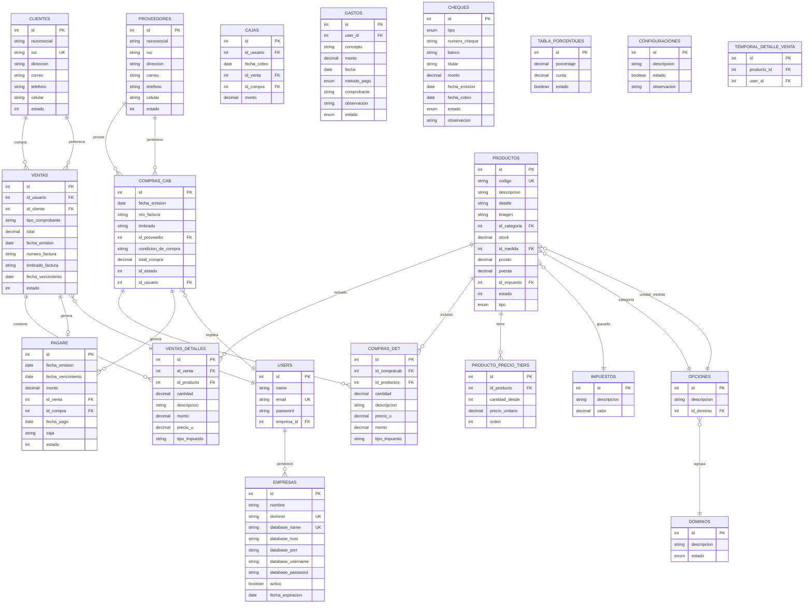

# Base de Datos

## Diagrama Entidad-Relación

---

## Migraciones (37 archivos)

| # | Archivo | Tabla | Propósito |
|---|---------|-------|-----------|
| 1 | `2014_10_12_000000` | users | Usuarios del sistema |
| 2 | `2014_10_12_100000` | password_reset_tokens | Tokens de reseteo (Laravel 10) |
| 3 | `2014_10_12_100000` (legacy) | password_resets | Tokens de reseteo legacy |
| 4 | `2019_08_19_000000` | failed_jobs | Jobs fallidos |
| 5 | `2019_12_14_000001` | personal_access_tokens | Tokens Sanctum |
| 6 | `2023_05_30_142657` | eventos | Eventos genéricos |
| 7 | `2023_05_30_174422` | dominios | Dominios para opciones dinámicas |
| 8 | `2023_05_30_174432` | opciones | Valores dinámicos (categorías, unidades) |
| 9 | `2023_05_31_192647` | productos | Productos |
| 10 | `2023_05_31_192659` | clientes | Clientes |
| 11 | `2023_05_31_192719` | proveedores | Proveedores |
| 12 | `2023_05_31_192807` | compras (replaced) | Compras (reemplazada) |
| 13 | `2023_05_31_192815` | ventas | Ventas |
| 14 | `2023_08_07_133456` | compras_cab | Cabecera de compras |
| 15 | `2023_08_07_133631` | compras_det | Detalle de compras |
| 16 | `2024_02_11_084805` | ventas_detalles | Detalle de ventas |
| 17 | `2024_02_12_084612` | pagare | Cuotas de crédito |
| 18 | `2024_02_15_200511` | cajas | Pagos registrados |
| 19 | `2024_02_21_104811` | descuentos | Descuentos en ventas |
| 20 | `2024_02_23_210912` | roles (legacy) | Permisos legacy |
| 21 | `2024_02_29_095410` | tabla_porcentajes | Recargos por cuota |
| 22 | `2024_03_11_175303` | temporal_detalle_venta | Carrito temporal QR |
| 23 | `2024_06_10_203333` | configuraciones | Configuración del sistema |
| 24 | `2024_06_14_093705` | (alter productos) | Agrega campos mayoristas |
| 25 | `2025_08_20_103120` | (alter productos) | Agrega estado |
| 26 | `2025_10_29_083050` | (alter productos) | Agrega imagen |
| 27 | `2025_12_02_070047` | categorias_gastos | Categorías de gastos |
| 28 | `2025_12_02_075148` | gastos | Gastos operativos |
| 29 | `2025_12_25_124840` | impuestos | Impuestos/IVA |
| 30 | `2026_01_04_091322` | (alter productos) | Agrega id_impuesto |
| 31 | `2026_02_17_125417` | (alter productos) | Agrega tipo (venta/uso_interno) |
| 32 | `2026_03_12_095804` | cheques | Cheques |
| 33 | `2026_06_17_100001` | (Spatie) | Permisos y roles Spatie |
| 34 | `2026_06_17_200001` | (alter pagare) | Agrega id_compra |
| 35 | `2026_06_17_200002` | producto_precio_tiers | Precios mayoristas escalonados |
| 36 | `2026_06_20_000001` | empresas | Multi-tenant: empresas |
| 37 | `2026_06_20_000002` | (alter users) | Agrega empresa_id |

---

## Modelos y Relaciones Clave

| Modelo | Tabla | Relaciones principales |
|--------|-------|----------------------|
| **User** | users | `belongsTo(Empresa)`, `hasMany(Venta)`, `HasRoles` (Spatie) |
| **Empresa** | empresas | `hasMany(User)`, datos de conexión encriptados |
| **Cliente** | clientes | `hasMany(Venta)` |
| **Proveedor** | proveedores | `hasMany(Compra_cab)` |
| **Producto** | productos | `belongsTo(Opcion)` (categoría + medida), `belongsTo(Impuesto)`, `hasMany(ProductoPrecioTier)` |
| **Venta** | ventas | `belongsTo(User)`, `belongsTo(Cliente)`, `hasMany(VentaDetalle)`, `hasOne(Pagare)` |
| **Compra_cab** | compras_cab | `belongsTo(Proveedor)`, `belongsTo(User)`, `hasMany(Compra_det)`, `hasMany(Pagare)` |
| **Pagare** | pagare | `belongsTo(Venta)`, `belongsTo(Compra_cab)` |
| **Caja** | cajas | `belongsTo(User)`, `belongsTo(Venta)`, `belongsTo(Compra_cab)` |
| **Opcion** | opciones | `belongsTo(Dominio)`, usado por Producto, Cliente, Proveedor, Mascota |

---

## Seeders

| Seeder | Datos que crea |
|--------|----------------|
| `DatabaseSeeder` | Dominios (3=CATEGORIA, 5=UNIDAD MEDIDA) |
| | Opciones (categorías y unidades de medida) |
| | Configuraciones (ventas=1, condicionv=1) |
| | Impuestos (IVA 5%, 10%) |
| | Usuario admin (admin@admin.com / 12345678) |

---

## Convenciones de Migraciones

- Nombres en camelCase descriptivo (`add_empresa_id_to_users_table`).
- Las migraciones de alteración de tablas existentes usan sufijo descriptivo.
- Las tablas pivote de Spatie se crean con prefijo estándar (`permissions`, `roles_spatie`, `model_has_permissions`, etc.).
- Las migraciones multi-tenant (`empresas`, `empresa_id`) se ejecutan solo en la base central.
